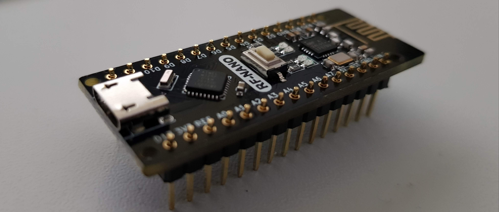

# arduino nano rf

Here is my code for the Nano RF replica.
It is a Arduino Nano compatible board with an NRF24 Chip on it.

Library used:
https://github.com/tmrh20/RF24/

Visit 
www.fambach.net for german descriptions.

Also visit the Producer Site:
https://github.com/emakefun/emakefun-nano-plus

Help in english can be provided by comments or just contact me.

Best Regards

Stefan 
