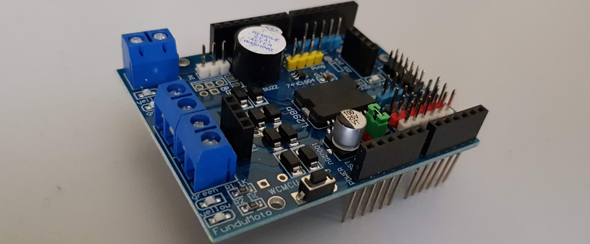

Item Description:
 
 
L298P motor driver shield adopts L298P driver chip, 
such chip is exclusively made for high-quality large power motor. 
It can directly drive two DC motors with driving current reaching 2A. 
The output port of the motor carries eight high speed Schottky diodes as its protection. 
The stackable design makes it possible to be directly connected to FOR Arduino, 
making it more convenient to use! (Source AliExpress)
 
 
Features:
 
Input voltage (VD) of logical part: 5V
input voltage (VS) of driving part: VIN input 6.5~12V; PWRIN input 4.8~24V
Working current (Iss) of logical part:≤36 mA
Working current (Io) of driving part: ≤ 2 A
Maximum dissipation power: 25 w (T = 75 °)
Input level of control signal: high level: 2 . 3 V≤V i n≤5 V; low level: - 0 . 3 V≤V i n≤1 . 5 V
Working temperature: - 25 + 130 °
Drive: Dual road large power H bridge drive

and needs the following libraries:

Visit http://www.fambach.net for more informations.
