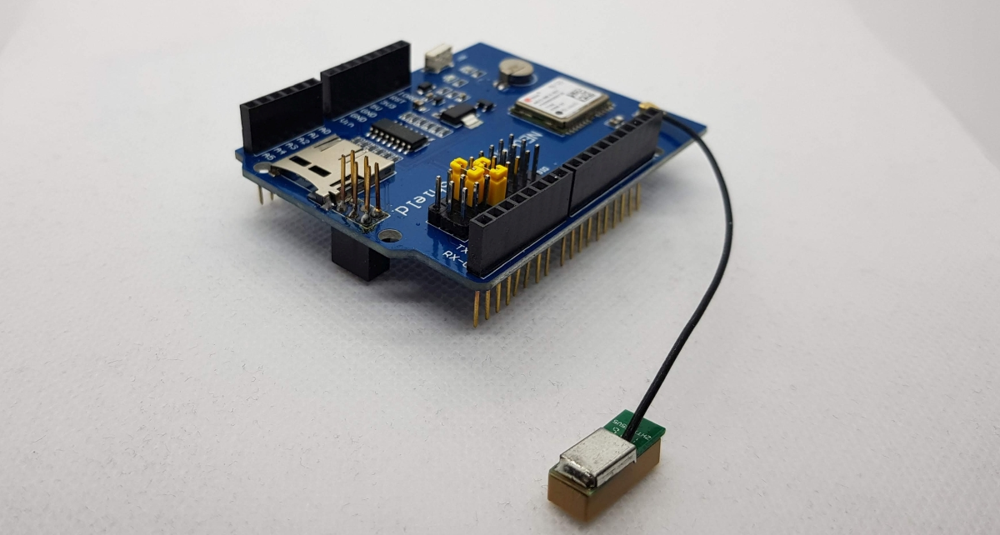

Arduino NEO-6M GPS Logging Shield V1.0

The examples are based on the library examples. Please see not in source code

Used Libs:
https://github.com/mikalhart/TinyGPSPlus
https://github.com/arduino/ArduinoCore-avr/tree/master/libraries/SoftwareSerial
https://github.com/arduino-libraries/SD

Visit http://www.fambach.net for more informations.
