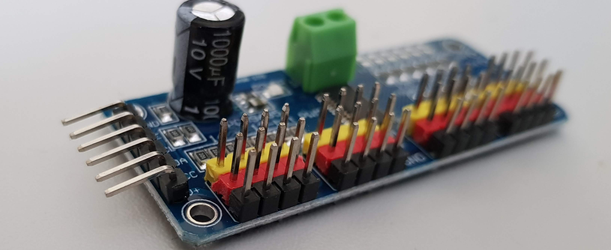

PCA9685 Servo Driver Board
It can control up to 16 Servos via I2C Bus.
This project is for the following shield:

and needs the following libraries:

https://github.com/adafruit/Adafruit-PWM-Servo-Driver-Library

Visit http://www.fambach.net for more informations.
