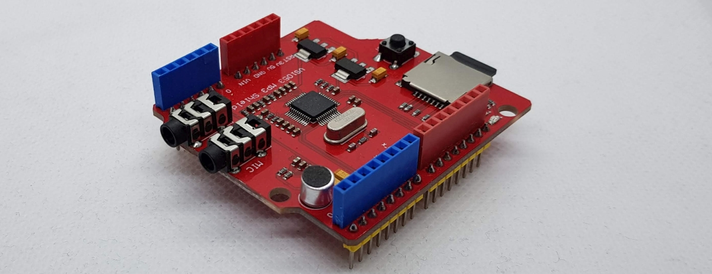

Arduino VS1053 MP3 Audio Shield

I added some examples here are the real sources of them:

https://www.elecrow.com/wiki/index.php?title=File:MP3_Shield_libraries.zip
https://github.com/pschatzmann/arduino-audio-tools

Visit http://www.fambach.net for more informations but only if you really want ;) 
