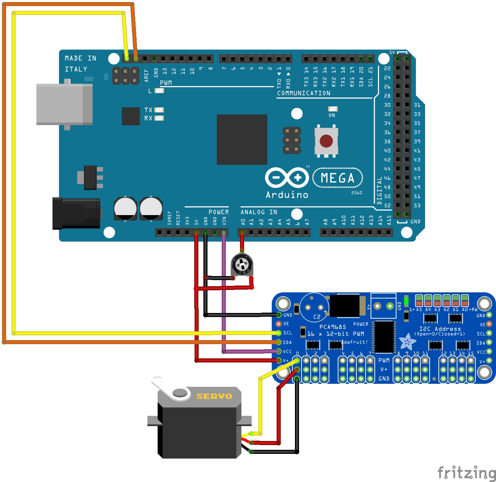

# Description
Control for Servos via adjustable resitors
It can control up to 16 servos with an Arduino Mega.

## Settings
Setup in the code below
* USMIN Minimum Servo value ~600
* USMAX Maximum Servo value ~2400
* POTI_INPUTS - Array for the analogoues inputs of the potis for arduino mega A0 -A15
* POTI_COUNT - count of poti and servo pairs
* THESHOLD

## Libs
https://github.com/adafruit/Adafruit-PWM-Servo-Driver-Library

## Hardware 
* Arduino Mega
* PCA9685 16 Channel Servo Driver Board

## Credits 
* Licence: AGPL3
* Author:  S. Fambach
Visit http://www.fambach.net if you want