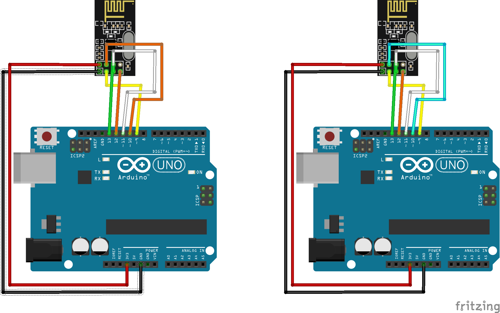

## Simple nRF24L01(+) Module test
This project:

Receiver
Transmtter

put each on an Arduino, and connect an nRF24 Module to them.

## Libs
This project uses the Adeept nRF derivat, to have a working version the files are also located in the subfolders
https://www.adeept.com/blog/wp-content/uploads/2019/03/AdeeptMotor.ino 

Visit www.fambach.net for more informations.

https://www.fambach.net/funk-ueber-2-4-ghz-nrf24l01-module/